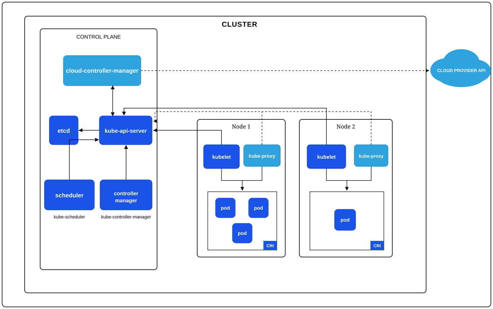
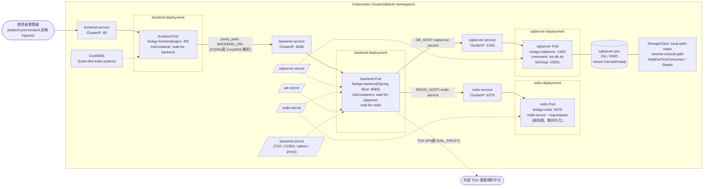

# lookGo — Kubernetes 叢集架構圖與 YAML 配置對應

> 上半部為依原圖重繪的 K8s 標準架構;中段為本專案實際部署架構(Mermaid 語法);下半部條列 `k8s/` 目前 manifests 與圖中各元件的關聯。

## K8s 標準架構圖

圖例說明(對應原圖):

- **實線**:kubelet、scheduler、controller manager 與 kube-api-server 之間的常規通訊;kubelet/kube-proxy 對節點上 Pod 的管理。
- **虛線**:kube-proxy 監看 api-server 的 Service/Endpoints;cloud-controller-manager 呼叫外部 Cloud Provider API。
- **CRI 框**:每個節點上由 Container Runtime(CRI)實際承載的 Pod 群。

## 目前專案的 K8s 部署架構

以 `k8s/` 目錄實際資源命名繪製(frontend / backend / redis / sqlserver 各 `replicas: 1`,Service 均為 ClusterIP):

- **實線**:實際流量路徑(使用者 → frontend → backend → redis / sqlserver,皆透過 ClusterIP Service 轉發)。
- **虛線**:Secret 以 `secretKeyRef` 注入環境變數;CoreDNS 提供名稱解析;backend 對外呼叫 TDX API。
- initContainers 對應啟動順序:sqlserver、redis 先就緒 → backend → frontend。

## 目前 YAML 配置與架構圖的關聯

### 宣告式流程:所有 manifests 都從 kube-api-server 進入叢集

- `kubectl apply` 送出的 `backend.yaml`、`frontend.yaml`、`redis.yaml`、`sqlserver.yaml`、`local-path-retain-storageclass.yaml` 與各 Secret,全部經圖中的 **kube-api-server** 驗證後,以「期望狀態」寫入 **etcd**。
- 各 `secretKeyRef`(sqlserver-secret、redis-secret、jwt-secret、backend-secret)的實際值也存放在 etcd,由 API server 交給節點上的 kubelet 注入容器環境變數。

### controller manager:維持 Deployment 的期望副本

- 四個 Deployment 都宣告 `replicas: 1`;**kube-controller-manager** 內的 Deployment/ReplicaSet controller 持續比對 etcd 中的期望狀態與實際 Pod 數,不足就補建、多了就刪除。
- `selector.matchLabels: app: xxx` 與 Pod template 的 `labels` 一致,是 controller 認領 Pod 的依據;Service 也用同一組 label 挑選流量目標。

### scheduler:決定 Pod 落點,並與儲存綁定互動

- Pod 建立後由 **kube-scheduler** 挑選節點(圖中 Node 1 / Node 2)。
- StorageClass `local-path-retain` 設 `volumeBindingMode: WaitForFirstConsumer`——刻意等 scheduler 先把 sqlserver Pod 排到某個節點,才在該節點上動態建立 local-path volume,避免 volume 與 Pod 落在不同節點。

### kubelet + CRI:節點上實際把 Pod 跑起來的元件

- `imagePullPolicy: IfNotPresent` 由 **kubelet** 判斷是否透過 **CRI** 拉取 `lookgo-*` 映像。
- 三個 busybox `initContainers`(frontend 等 backend、backend 等 sqlserver/redis)由 kubelet 依序執行完畢後才啟動主容器。
- 所有 liveness / readiness 探針——backend/frontend 的 `httpGet`、redis 的 `redis-cli ping`、sqlserver 的 `sqlcmd SELECT 1`——都是由 Pod 所在節點的 kubelet 執行,結果回報給 api-server(對應圖中 kubelet ↔ kube-api-server 連線)。
- sqlserver 的 `fsGroup: 10001`、PVC 掛載 `/var/opt/mssql`,也由 kubelet 在掛載 volume 時套用。

### kube-proxy:讓四個 ClusterIP Service 可被連線

- `frontend-service`、`backend-service`、`redis-service`、`sqlserver-service` 都是 `ClusterIP`;每個節點的 **kube-proxy** 從 api-server 監看 Service/Endpoints(圖中虛線),在本機寫入轉發規則。
- backend 用 `DB_HOST: sqlserver-service`、`REDIS_HOST: redis-service` 連線;frontend nginx 用 `BACKEND_URL`(FQDN)反向代理——封包實際由 kube-proxy 導到符合 label 的 Pod。名稱解析則靠叢集 DNS(CoreDNS,本身也是跑在節點上的 Pod),`DNS_RESOLVER` 即指向它。

### cloud-controller-manager / Cloud Provider API:目前配置刻意不依賴

- 本專案是本機開發叢集,儲存改用 `rancher.io/local-path` 動態供應(取代雲端磁碟),Service 也沒有 `LoadBalancer` 型別——圖右側 **cloud-controller-manager → Cloud Provider API** 這條虛線在目前配置中沒有實際作用。
- 若日後上雲,PVC 會改由雲端 StorageClass 供應、對外入口(Ingress/LoadBalancer)才會經由這條路徑建立雲端資源。

### 圖中的 pod 對應到誰

| 圖中元素 | 本專案對應 |
|---|---|
| Node 上的 pod | frontend、backend、redis、sqlserver 各 1 個 Pod(`replicas: 1`) |
| pod 內容器 | 主容器 + busybox initContainers(啟動前等待依賴) |
| 節點本機磁碟 | sqlserver-pvc → local-path volume(`Retain`,Pod 刪除資料仍保留) |
| 無持久化的 pod | redis 為純快取,無 PVC,重啟即清空 |

> 依 `docs/k8s-review.md`:目前為單機開發等級配置;resources、鏡像 tag、StatefulSet/Recreate、Ingress 等改善項尚未處理。
